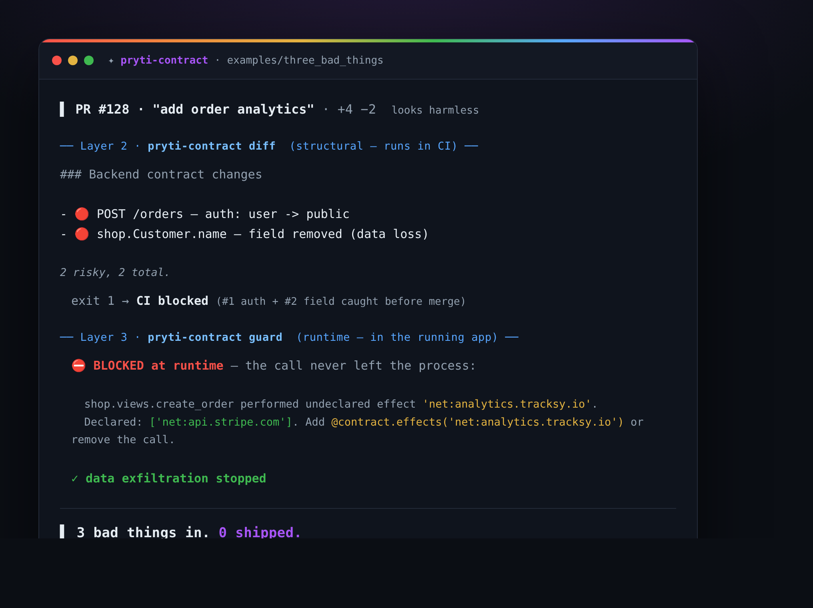

# 3 bad things, 0 get through

One AI-written PR — *"add order analytics"* — sneaks in three dangerous changes.
`pryti-contract` catches all three: two structurally in CI, one at runtime.



## The PR

| # | Change | Why it's bad | Caught by |
|---|--------|--------------|-----------|
| 1 | `POST /orders` auth `user` → `public` | anyone can place orders | **diff** (CI) |
| 2 | `Customer.name` field deleted | silent data loss on migrate | **diff** (CI) |
| 3 | call to `analytics.tracksy.io` | never declared — data exfil | **guard** (runtime) |

The diff sees #1 and #2 because they change the app's *declared* shape. It **can't**
see #3 — an undeclared call is invisible to any static tool. That's the guard's job:
it runs the code and stops the call the instant it tries to leave the process.

## Run it

```bash
pip install -e ".[dev]"      # from the repo root
bash examples/three_bad_things/run.sh
```

`before/` is the good app; `after/` is the same app with the three changes. Diff them
yourself — the whole PR is six lines.

## Render the GIF (optional)

```bash
# needs https://github.com/charmbracelet/vhs
vhs examples/three_bad_things/three-bad-things.tape   # -> three-bad-things.gif
```
